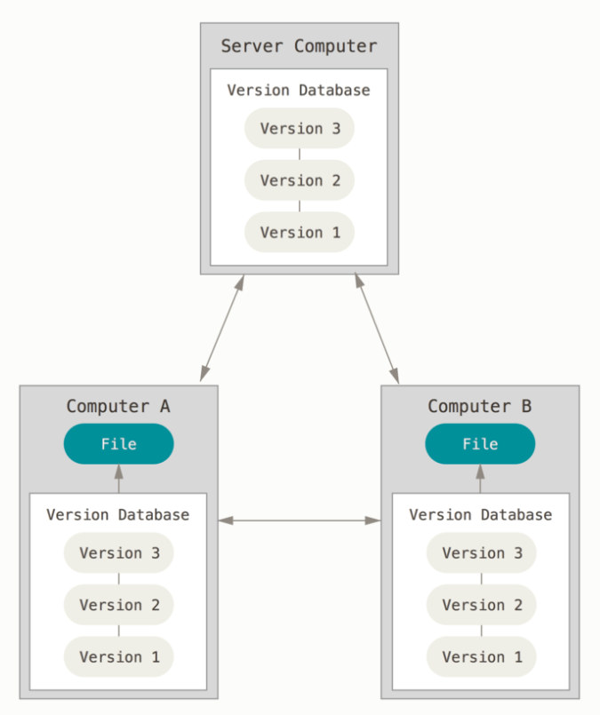
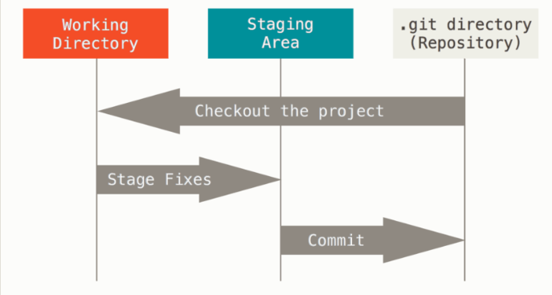

## 분산 버전 관리 시스템 



## 세가지 상태



## 명령어

```shell
git add .
```

- `working directory`에 있는 파일, 폴더를 `staging area`에 추가
- add 하기전엔 파일이 저장이 되었는지 확인하기

```shell
git commit -m 'message'
```

- `staging area`에 올라간 파일들을 저장

```shell
git remote add origin <remoterurl>
```
- 원격저장소 주소를 `origin`이라는 별명으로 저장


```shell
git push origin master
'```
- `master` 브랜치를 `origin` 원격저장소로 업로드